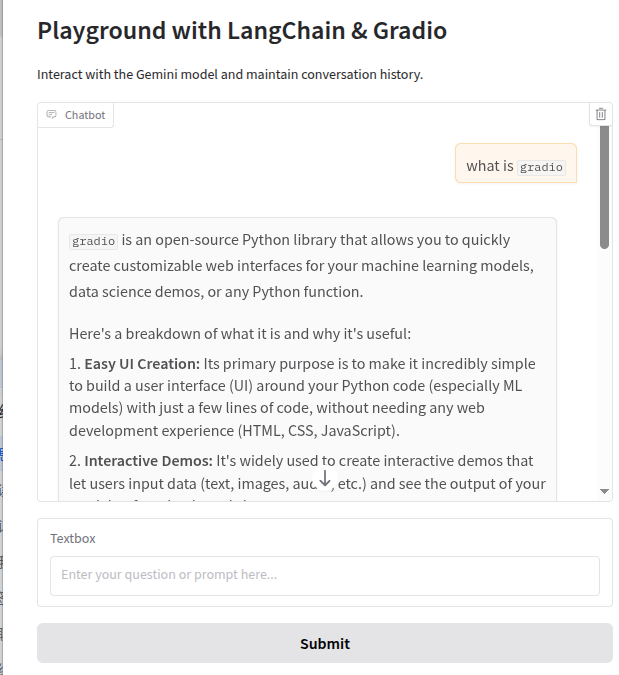
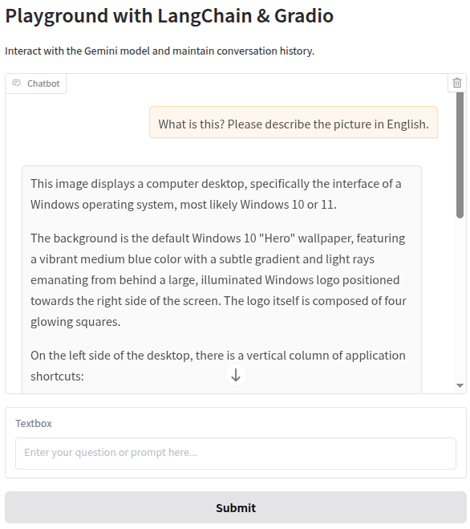
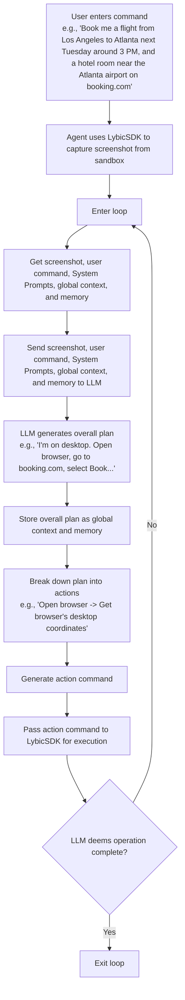
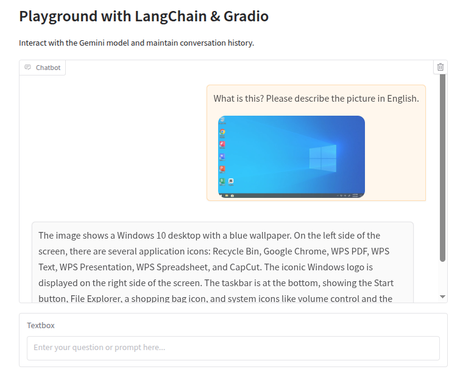
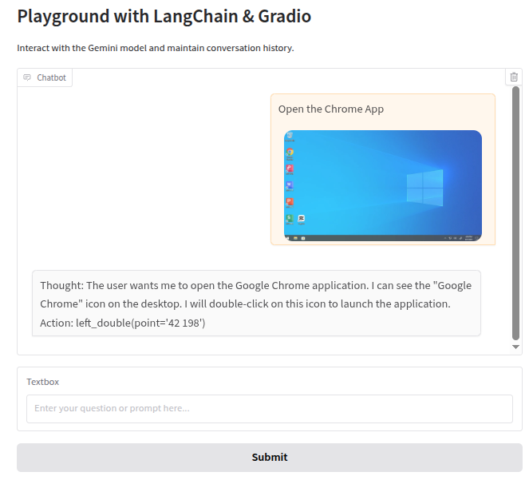
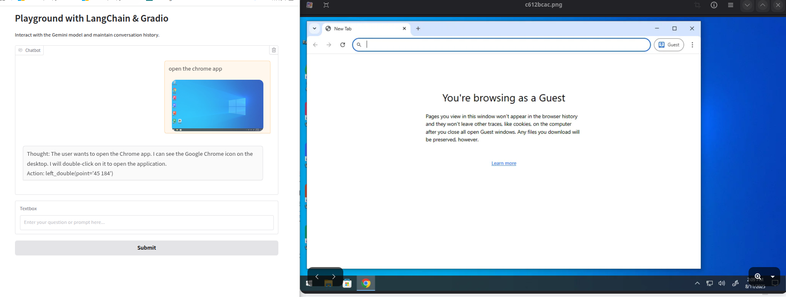
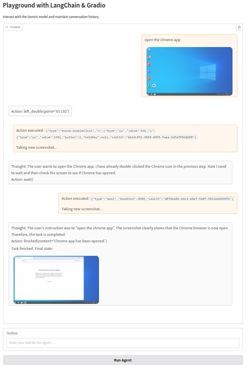

# Build a GUI Agent with LangChain, Gradio, and Gemini

This repository provides a step-by-step tutorial for building a GUI Agent that can understand and execute complex tasks 
on a computer.

We'll demonstrate how to combine LangChain, Gradio, and the Gemini model to create an AI agent that can see the screen,
think, and act within a secure, sandboxed desktop environment provided by LybicSDK.

Of course, you can also switch the Gemini model to other multimodal models by simply referencing other model dependencies.

---

## 🛠️ 1. Installation & Set-up project

1. Add / install dependencies

    ```bash
    pip install -r requirements.txt
    # pip install langchain langchain-google-genai gradio dotenv
    ```

2. Get Gemini API key and configuration

    Get a free Gemini API key from [Google-Ai-Studio](https://aistudio.google.com/).
    
    Copy `.env.example` to `.env` and fill in your Gemini API key in the `GOOGLE_API_KEY` field.

3. Running playground

    Here is the simplest example using langchain, gradio and Gemini: [Step-1-init](steps/step_1.py)

    Running the script: 

    ```bash
    python3 steps/step_1.py
    ```
    
    It will open a Gradio interface.

    ```
    * Running on local URL:  http://127.0.0.1:7860
    * To create a public link, set `share=True` in `launch()`.
    ```
   
4. Open the playground in your browser: 

    http://127.0.0.1:7860

    Type the text into the text box and click the `submit` button. 

    

## 💡 2. Utilize the visual capabilities of MLLMs with lybic

Next, we need to modify our first step script to fully utilize the `Multimodal Large Language Models` capabilities.

To do this, we need to make the following modifications:

1. Introducing non-text data sources (i.e., images): Import `lybic` and obtain screenshots from the `lybic` platform
sandbox.
    
   1. Use pip to install lybic: `pip install lybic==0.5.3`
   2. In your first step script, import `lybic` and initialize it by calling `LybicClient()`:
      ```python
      from lybic import LybicClient
      async def main():
        # you should set env vars before initialize LybicClient
        async with LybicClient() as client:
          pass 
      ```
   3. Get the screenshots from the sandbox:
      ```python
      import asyncio
      from lybic import LybicClient, Sandbox
        
      async def main():
        async with LybicClient() as client:
            sandbox = Sandbox(client)
            url, image, b64_str = await sandbox.get_screenshot(sandbox_id="SBX-xxxx")
            print(f"Screenshot URL: {url}")
            image.show()
        
      if __name__ == '__main__':
            asyncio.run(main())
      ```

2. Modifying message input: Import `langchain_core.messages` and convert the previous single message to a structured
message list to support multiple message types.

    ```python
    from langchain_core.messages import SystemMessage, AIMessage, HumanMessage
    messages = [
        HumanMessage(
        content=[
            {
                "type": "text",
                "text": "What is this? Please describe the picture in English."
            },
            {
                "type": "image_url",
                "image_url": {
                    "url": f"data:image/webp;base64,{ b64_str }"
                }
            }
        ]
    ),
    ]
    ```

3. Ok, let's try it out:

    The example code file is in [step-2](steps/step_2.py)

    type `What is this? Please describe the picture in English.` in the chat window, click the `submit` button, and you 
    will see the result in the chat window.

    

## 🌟 3. Build the Agent processing loop

This is **the most important** part of the module.

The architecture of this agent development is actually very simple, executing according to the following workflow:

1. The user enters a command: for example, "Book me a flight from Los Angeles to Atlanta next Tuesday around 3 PM, and a hotel room near the Atlanta airport on `booking.com`."
2. The agent then uses the LybicSDK to capture a screenshot from the sandbox.
3. Enters a loop: The screenshot, along with the user's command and System Prompts (and the global context and memory from the previous step), is sent to the LLM, allowing the LLM to make an overall (or next) plan.
4. The LLM generates an overall plan, such as "I'm currently on my desktop. I need to open a browser, go to booking.com, and select Book..."
5. The overall plan is stored as global context and memory, and is passed as an additional "overall plan" with each request.
6. The plan is broken down and executed: for example, "Open a browser -> Get the browser's desktop coordinates."
7. Generate an action command.
8. Pass the action command to the LybicSDK for execution.
9. Return to the beginning of step 3 and loop until the LLM deems the operation complete, exiting the loop.

### Workflow



We need to make the non-loop part of the process run successfully and as expected, and then add a loop to the main process at the end.

Ok, let's modify the code in the previous step!

1. See screenshot

    Let's see screenshots of each step in the chat box. It is very easy to see the screenshots.
    
    We just need to enable the Markdown text rendering function of gradio, and then output the image message in Markdown format.

    At `chatbot = gr.Chatbot()` line, add `render_markdown=True`, like this: `chatbot = gr.Chatbot(render_markdown=True)`

    Then,get screenshot-url from sandbox: `screenshot_url, _, base64_str = await sandbox.get_screenshot('sandbox_id')`

    Add screenshot-url to markdown: `user_message_for_history = f"{user_input}\n\n"`

    Ok, now you can see the screenshot in the chat box. [Code](steps/step_3_1.py)

    

2. Import System Prompts for computer-use Agent: 

    The prompts are:

       You are a GUI Agent, proficient in the operation of various commonly used software on Windows, Linux, and other operating systems.
       Please complete the user's task based on user input, history Action, and screen shots.
       The user will upload a current screenshot and input an instruction.
       You need to complete the entire task step by step, and output only one Action at a time, please strictly follow the format below.
    
       ## Output Format
       ```
       Thought: ...
       Action: ...
       ```
    
       ## Action Space
       click(point='<point>x1 y1</point>')
       left_double(point='<point>x1 y1</point>')
       right_single(point='<point>x1 y1</point>')
       drag(start_point='<point>x1 y1</point>', end_point='<point>x2 y2</point>')
       hotkey(key='ctrl c') # Split keys with a space and use lowercase. Also, do not use more than 3 keys in one hotkey action.
       type(content='xxx') # Use escape characters \', \", and \n in content part to ensure we can parse the content in normal python string format. If you want to submit your input, use \n at the end of content, and next action use hotkey(key='enter')
       scroll(point='<point>x1 y1</point>', direction='down or up or right or left') # Show more information on the `direction` side.
       wait() #Sleep for 5s and take a screenshot to check for any changes.
       finished(content='xxx') # Use escape characters \', \", and \n in content part to ensure we can parse the content in normal python string format.
       call_user() # Submit the task and call the user when the task is unsolvable, or when you need the user's help.
       save_memory(content='content') # When the user explicitly says "remember..." or something similar, `save_memory` is automatically called to save the memory. Next action use finished
       output(content='content') # It is only used when the user specifies to use output, and after output is executed, it cannot be executed again.
    
       ## Note
       - Use English in `Thought` part.
       - The x1,x2 and y1,y2 are the coordinates of the element.
       - The resolution of the screenshot is 1280*720.
       - Write a small plan and finally summarize your next action (with its target element) in one sentence in `Thought` part.

3. Append system prompt words to each request

    Add `system_message = SystemMessage(content=SYSTEM_PROMPT)` before this line `full_message_list = history_messages + message`,
and modify `full_message_list = history_messages + message` to `full_message_list = [system_message] + history_messages + message`.

    If nothing goes wrong, LLM will NOT spit out a correct coordinate format when you test the input and output like this:

        Thought: The user wants to open the Google Chrome application. I can see the "Google Chrome" icon on the desktop. I need to double-click on this icon to launch the application.
        Action: left_double(point='')

    This is because Gradio's default behavior is to sanitize HTML to prevent potential security issues, but this can interfere when you intend to render specific HTML tags.

    We only need to adjust the `gr.Chatbot` component to disable HTML sanitization.

    Al line `chatbot = gr.Chatbot(render_markdown=True)`, add `sanitize_html=False` to the `gr.Chatbot` component like this: `chatbot = gr.Chatbot(render_markdown=True, sanitize_html=False)`

    Ok, let's test the system prompt whether it works.

    Wow! Your [code](steps/step_3_3.py) works! 

    
    
4. Use lybic API to parse LLM output and execute the action

    Lybic providers a simple API to parse LLM output via `ComputerUse().parse_model_output()`, and execute the action.

    By reading this [document](https://github.com/lybic/lybic-sdk-python/blob/master/docs/example.md#class-computeruse)，

    To test the execution results, we've added a new feature: View Execution Results.
    This feature pops up a picture after the execution completes for us to view.
    
    `_, img, _ = await sandbox.get_screenshot(sandbox_id);img.show()`
     
    Ok, let's test the execution results.

    

    The execution result is correct. The [code](steps/step_3_4.py) works!
    
    **Note**: currently, the models that are more accurate for screen coordinate recognition are `ui-tars` and `OpenAI CUA`. 
    Other models may have certain errors or mistakes in screen coordinate recognition.

5. Introduce an event-problem-solving loop

    In this step, we will introduce an event-problem-solving loop.
    This loop is used to solve problems that cannot be solved by the LLM.
    
    LLM requires breaking down a large task into multiple smaller ones, executing each small task, and then `determining 
    the outcome or planning the next step`.
    This `determining the outcome or planning the next step` is the entry point into a loop.

    To enable the LLM to process tasks in a loop as an agent, we need to modify the playground function so that it can 
    continuously execute the "observe-think-act" process in a loop until the task is completed.

    This requires the following modifications:

    1. Introducing the Main Loop: In the playground function, we will add a while loop to simulate the agent's continuous work.
    2. State Tracking: Each step in the loop requires obtaining the latest screenshot as the agent's "observation" input.
    3. Termination Condition: The agent needs to know when the task is complete. We will rely on the LLM output of the finished() action as the loop exit signal.
    4. Real-time Feedback: To allow the user to see every step the agent takes, we will leverage Gradio to update the chat log at each step in the loop.

    Ok, let's modify the [code](steps/step_3_5.py).
    
    Note: at the key point between [step-3-4](steps/step_3_4.py) and [step-3-5](steps/step_3_5.py): 

    - **IMPORTANT** Use `yield` to make the function asynchronous return.
    - **IMPORTANT** Add `while True` loop after `history.append([user_message_for_history, "Thinking..."])`. 
    - Update history with the LLM's thought process: `history[-1][1] = response`
    - Check for termination condition: `if isinstance(action, dto.FinishedAction):`

    The result is as follows:
    
    

    Wow! Your [code](steps/step_3_5.py) works!
